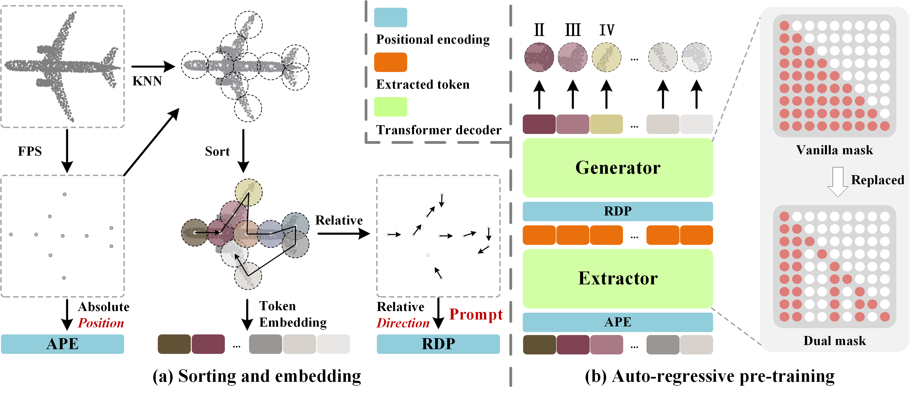

# PointGPT

## PointGPT: Auto-regressively Generative Pre-training from Point Clouds [ArXiv](https://arxiv.org/abs/2305.11487)

In this work, we present PointGPT, a novel approach that extends the concept of GPT to point clouds, utilizing a point cloud auto-regressive generation task for pre-training transformer models. In object classification tasks, our PointGPT achieves 94.9% accuracy on the ModelNet40 dataset and 93.4% accuracy on the ScanObjectNN dataset, outperforming all other transformer models. In few-shot learning tasks, our method also attains new SOTA performance on all four benchmarks.

<div  align="center">    
 
</div>

## News

[2023.06.20] Code and the PointGPT-S models have been released!


## 1. Requirements

PyTorch >= 1.7.0;
python >= 3.7;
CUDA >= 9.0;
GCC >= 4.9;
torchvision;

```
pip install -r requirements.txt
```

```
# Chamfer Distance & emd
cd ./extensions/chamfer_dist
python setup.py install --user
cd ./extensions/emd
python setup.py install --user
# PointNet++
pip install "git+https://github.com/erikwijmans/Pointnet2_PyTorch.git#egg=pointnet2_ops&subdirectory=pointnet2_ops_lib"
# GPU kNN
pip install --upgrade https://github.com/unlimblue/KNN_CUDA/releases/download/0.2/KNN_CUDA-0.2-py3-none-any.whl
```

## 2. Datasets

We use ShapeNet, ScanObjectNN, ModelNet40 and ShapeNetPart for pre-training the PointGPT-S model. See [DATASET.md](./DATASET.md) for details.

## 3. PointGPT Models
### PointGPT-S Models
| Task              | Dataset        | Config                                                          | Acc.       | Download                                                                                      |
| ----------------- | -------------- | --------------------------------------------------------------- | ---------- | --------------------------------------------------------------------------------------------- |
| Pre-training      | ShapeNet       | [pretrain.yaml](./cfgs/pretrain.yaml)                           | N.A.       | [here](https://drive.google.com/file/d/1gTFI327kXVDFQ90JfYX0zIS4opM1EkqX/view?usp=drive_link) |
| Classification    | ScanObjectNN   | [finetune_scan_hardest.yaml](./cfgs/finetune_scan_hardest.yaml) | 86.9%      | [here](https://drive.google.com/file/d/12Tj2OFKsEPT5zd5nQQ2VNEZlCKHncdGh/view?usp=drive_link) |
| Classification    | ScanObjectNN   | [finetune_scan_objbg.yaml](./cfgs/finetune_scan_objbg.yaml)     | 91.6%      | [here](https://drive.google.com/file/d/1s4RrBkfwVr8r0H2FxwiHULcyMe_EAJ9D/view?usp=drive_link) |
| Classification    | ScanObjectNN   | [finetune_scan_objonly.yaml](./cfgs/finetune_scan_objonly.yaml) | 90.0%      | [here](https://drive.google.com/file/d/173yfDAlqqed-oRHaogX6DC4Uj1b8Rvxt/view?usp=drive_link) |
| Classification    | ModelNet40(1k) | [finetune_modelnet.yaml](./cfgs/finetune_modelnet.yaml)         | 94.0%      | [here](https://drive.google.com/file/d/17uoJchAzwapTNHVxOWNH4HLNZz9kbGoo/view?usp=drive_link) |
| Classification    | ModelNet40(8k) | [finetune_modelnet_8k.yaml](./cfgs/finetune_modelnet_8k.yaml)   | 94.2%      | [here](https://drive.google.com/file/d/1XocTFSsKZgKHx2cLqZJi2rcF74hQ-1nx/view?usp=drive_link) |
| Part segmentation | ShapeNetPart   | [segmentation](./segmentation)                                  | 86.2% mIoU | [here](https://drive.google.com/file/d/1WVMTtIq4vPQOOnlDsymVA5541lNL-hm3/view?usp=drive_link) |

| Task              | Dataset    | Config                              | 5w10s Acc. (%) | 5w20s Acc. (%) | 10w10s Acc. (%) | 10w20s Acc. (%) |
| ----------------- | ---------- | ----------------------------------- | -------------- | -------------- | --------------- | --------------- |
| Few-shot learning | ModelNet40 | [fewshot.yaml](./cfgs/fewshot.yaml) | 96.8 ± 2.0     | 98.6 ± 1.1     | 92.6 ± 4.6      | 95.2 ± 3.4      |

PointGPT-B and PointGPT-L will be released soon!

## 4. PointGPT Pre-training

To pretrain PointGPT on ShapeNet training set, run the following command. 

```
CUDA_VISIBLE_DEVICES=<GPU> python main.py --config cfgs/pretrain.yaml --exp_name <output_file_name>
```
## 5. PointGPT Fine-tuning

Fine-tuning on ScanObjectNN, run the following command:
```
CUDA_VISIBLE_DEVICES=<GPUs> python main.py --config cfgs/finetune_scan_hardest.yaml \
--finetune_model --exp_name <output_file_name> --ckpts <path/to/pre-trained/model>
```
Fine-tuning on ModelNet40, run the following command:
```
CUDA_VISIBLE_DEVICES=<GPUs> python main.py --config cfgs/finetune_modelnet.yaml \
--finetune_model --exp_name <output_file_name> --ckpts <path/to/pre-trained/model>
```
Voting on ModelNet40, run the following command:
```
CUDA_VISIBLE_DEVICES=<GPUs> python main.py --test --config cfgs/finetune_modelnet.yaml \
--exp_name <output_file_name> --ckpts <path/to/best/fine-tuned/model>
```
Few-shot learning, run the following command:
```
CUDA_VISIBLE_DEVICES=<GPUs> python main.py --config cfgs/fewshot.yaml --finetune_model \
--ckpts <path/to/pre-trained/model> --exp_name <output_file_name> --way <5 or 10> --shot <10 or 20> --fold <0-9>
```
Part segmentation on ShapeNetPart, run the following command:
```
cd segmentation
python main.py --ckpts <path/to/pre-trained/model> --root path/to/data --learning_rate 0.0002 --epoch 300
```

## 6. Visualization

Visulization of pre-trained model on ShapeNet validation set, run:

```
python main_vis.py --test --ckpts <path/to/pre-trained/model> --config cfgs/pretrain.yaml --exp_name <name>
```

<div  align="center">    
 
</div>


## Acknowledgements

Our codes are built upon [Point-MAE](https://github.com/Pang-Yatian/Point-MAE), [Point-BERT](https://github.com/lulutang0608/Point-BERT), [Pointnet2_PyTorch](https://github.com/erikwijmans/Pointnet2_PyTorch) and [Pointnet_Pointnet2_pytorch](https://github.com/yanx27/Pointnet_Pointnet2_pytorch)

## Reference

```
@article{chen2023pointgpt,
  title={PointGPT: Auto-regressively Generative Pre-training from Point Clouds},
  author={Chen, Guangyan and Wang, Meiling and Yang, Yi and Yu, Kai and Yuan, Li and Yue, Yufeng},
  journal={arXiv preprint arXiv:2305.11487},
  year={2023}
}
```